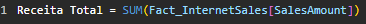
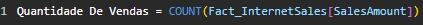
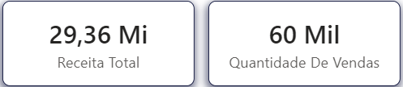

# **Medidas Escalares**

As medidas escalares são funções simples que transformam os dados para a obtenção de um resultado.

Elas são divididas em:

- **Funções de Agregação**
- **Funções de Iteração**

## Funções de Agregação

Funções: `SUM`, `AVERAGE`, `MAX`, `MIN`, `COUNT`, `DISTINCTCOUNT`

As Funções de Agregação consideram todo o conjunto por um todo, como um grupo, e realizam operações incluindo todos os dados da coluna.

### Função	Descrição: 
- `SUM`	Soma todos os dados de uma coluna.
- `AVERAGE`	Retorna a média de todos os dados da coluna.
- `MAX`	Retorna o maior valor da coluna.
- `MIN`	Retorna o menor valor da coluna.
- `COUNT`	Conta todos os itens da coluna.
- `DISTINCTCOUNT`	Conta todos os itens distintos da coluna.

## Estrutura

Para utilizar essas funções, basta criar uma medida e seguir a seguinte estrutura:

```
[Nome_da_Medida] = [Função]([Coluna])
```

## Exemplo prático

Em uma tabela de vendas, vamos calcular a receita total da empresa e contar quantas vendas ocorreram.

### Criando a medida

Define-se o nome, a expressão e a coluna que está na tabela Fact_Sales, na coluna Revenue.





### Exemplo de aplicação:



(cartões do Bower bi com as medidas criadas acima)
